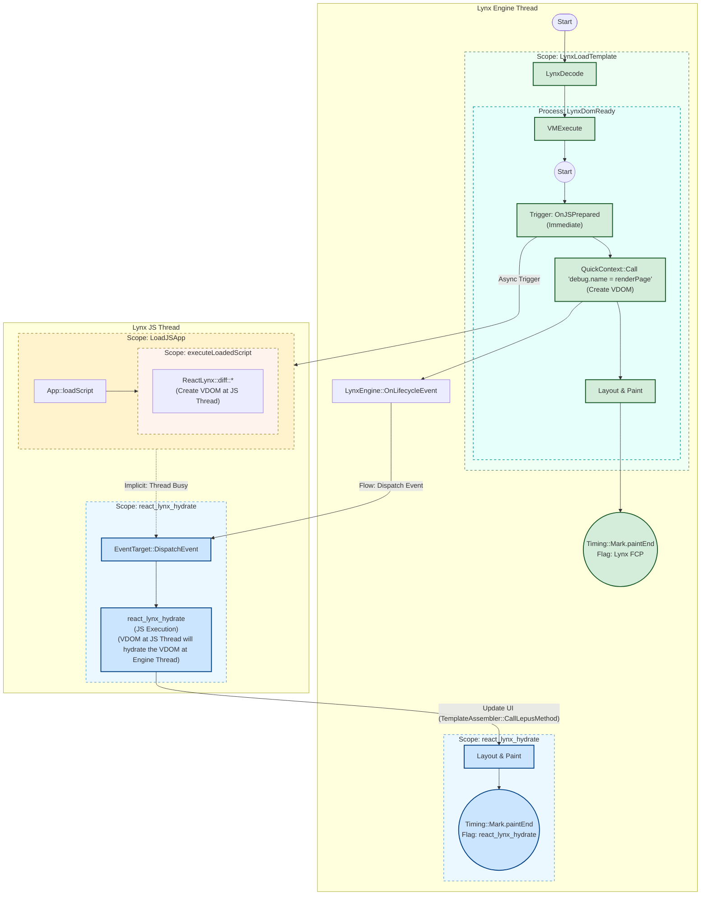

# trace-analysis

## Introduction

Trace analysis is a relatively complex process involving multiple concepts and tools. Here are explanations of key terms:

| Term | Description |
| --- | --- |
| Lynx | Lynx is a high-performance cross-platform framework for building Native views using the Web tech stack. It supports cross-platform development (covering Android, iOS, Web, etc.) and uses a multi-threaded model. |
| Perfetto | Lynx uses [Perfetto](https://github.com/google/perfetto) as its performance profiling tool. |
| `trace_processor_api` script | A tool that ingests traces encoded in a wide variety of formats and exposes an SQL interface for querying trace events contained in a consistent set of tables. It also has other features including computation of trace summaries, annotating the trace with user-friendly descriptions and deriving new events from the contents of the trace. |
| `.ptrace` file | Traces exist in the form of `.ptrace` files. A single `.ptrace` file may contain multiple LynxView instances. Each instance may generate multiple Lynx Bundle loading events, and each loading event may involve multiple rendering pipelines. Additionally, multiple Lynx threads (such as the Main thread, Layout thread, JS thread, etc.) jointly participate in the rendering process. |
| Lynx Instance, `debug.instance_id` | An instance of Lynx Engine |
| Lynx Bundle, `debug.pipeline_id` | Where all necessary resources needed for a Lynx App to run are bundled together. This usually comprises of: stylesheet, scripts, serialized element tree |
| LynxView | Similar to WebView in native developing. Renders bundle within host application’s context. |
| Pipeline, `debug.pipeline_id` | The lynx pipeline in Lynx development refers to the sequence of steps a Lynx app takes to convert its internal structures into the visual representation that users see and interact with on their screens. |
| Timing Flags, `debug.timing_flags` | The identifier (flag) of a Pipeline |
| LoadTemplate, `LynxLoadTemplate` | Load the Lynx Bundle (historical "Template"), resulting in FCP |

## Input

A path to a `.ptrace` file or a link to it. If not provided, guide the user to reference the [Trace in lynxjs.org](https://lynxjs.org/guide/devtool/trace) documentation to record one.

## Output

The default behavior of this Skill is to analyze the trace and output a detailed report, primarily focusing on performance bottlenecks. Unless clearly specified otherwise, output a markdown-formatted text containing the following content:

```markdown
# Trace Analysis Result

## Trace Metadata

OS: Darwin
Device: iPhone 16
Lynx Engine Version: 3.4.11-rc.8
...

## Lynx Instance List

- **Instance ID**: <instance_id1>
  - Bundle URL: https://example.com/bundle1.lynx.bundle

- **Instance ID**: <instance_id2>
  - Bundle URL: https://example.com/bundle2.lynx.bundle

## Performance Bottleneck Analysis

### Instance ID: <instance_id1>

*(Brief introduction of this Lynx Instance)*

#### FCP Process Analysis

- Critical Path: LynxDecode -> VMExecute -> LynxDomReady -> renderPage -> Layout & Paint -> Timing::Mark.paintEnd (Lynx FCP)
- Total Duration: XX ms

*(Identified performance bottlenecks)*

#### Hydration Process Analysis

- Critical Path: LoadJSApp -> DispatchEvent -> react_lynx_hydrate -> Layout & Paint -> Timing::Mark.paintEnd (react_lynx_hydrate)
- Total Duration: XX ms

*(Identified performance bottlenecks)*

### Instance ID: <instance_id2>

*(Brief introduction of this Lynx Instance)*

... (Same as above, FCP and Hydration process analysis) ...

## Summary and Recommendations

...

```

If the user explicitly requests other behaviors, such as executing specific SQL queries, outputting results in a specific format, or even helping to fix performance issues, proceed according to the user's requirements.

## Task Execution Steps - trace analysis

### 1.1 Get Trace Metadata

Execute the following SQL query to get the trace metadata:

```sql
SELECT * FROM metadata;
```

### 1.2 Get Lynx Engine Version

Execute the following SQL query to get Lynx instance information:

```sql
SELECT a.display_value as value FROM slice s LEFT JOIN args a ON s.arg_set_id = a.arg_set_id WHERE (s.name = 'LynxEngineVersion' or s.name = 'Version') and (a.key = 'debug.version' or a.key = 'args.version');
```

### 1.3 List all Lynx Instance IDs

The following SQL query lists all Lynx Bundle loading events, including the start time, duration, Lynx Bundle URL, and Lynx Instance ID for each event:

```sql
SELECT
  s.id,
  (s.ts - (SELECT start_ts FROM trace_bounds)) / 1e9 AS start_time_s,
  s.dur / 1e6 AS duration_ms,
  MAX(CASE WHEN a.key = 'debug.url' THEN a.display_value END) as bundle_url,
  MAX(CASE WHEN a.key = 'debug.instance_id' THEN a.display_value END) as instance_id,
FROM slice s
JOIN args a ON s.arg_set_id = a.arg_set_id
WHERE s.name = 'LynxLoadTemplate'
GROUP BY s.id
ORDER BY s.dur DESC;
```

From the execution results above, for each `instance_id`, perform the following steps:

### 2 Analyze FCP and Hydration Processes for instance_id

Any Lynx app goes through two stages during startup: FCP and Hydration. Analyzing performance bottlenecks in these two stages is crucial. However, due to Lynx's multi-threaded model and complex event dependencies, analyzing these bottlenecks is not easy. Below is a dependency graph showing the main events and their dependencies during a Lynx app startup:



From the graph above, it is easy to analyze the critical paths to reach FCP and Hydration, as well as the performance bottlenecks in each stage.

**Note:**

- When writing SQL queries, pay attention to adding the `debug.instance_id` filter condition.
- Filter events by joining the `slice` and `args` tables, and use `debug.timing_flags = "Lynx FCP"` or `debug.timing_flags = "react_lynx_hydrate"` to filter events belonging to the FCP or Hydration stage.
- FCP happens mostly on the Engine Thread, while Hydration involves both the JS Thread and Engine Thread. When analyzing Hydration bottlenecks, consider events on both threads and their dependencies.

### 4 Generate Final Report

Refer to the format in [Output](#output) to generate the final analysis report.

## Appendix

### About Executing PerfettoSQL

In general, PerfettoSQL within this Skill is executed via the following methods, without requiring extra tool configuration (like MCP):

- View help:

```bash
node <path_to_the_skill>/scripts/trace_processor_api.mjs --help
```

- Execute a query (single-line SQL):

```bash
node <path_to_the_skill>/scripts/trace_processor_api.mjs "<path_to_ptrace_file>" "SELECT * FROM metadata;"
```

- Execute a query (split into multiple lines for readability, using "\" to escape newlines):

```bash
node <path_to_the_skill>/scripts/trace_processor_api.mjs "<path_to_ptrace_file>" "\
SELECT name, ts, dur FROM slice \
WHERE name LIKE 'ReactLynx::%' \
LIMIT 10;"
```

- Execute a query from a file (SQL stored in a separate file, using "-" to read from standard input):

```bash
cat "some_sql_file.sql" | node <path_to_the_skill>/scripts/trace_processor_api.mjs "<path_to_ptrace_file>" -
```
